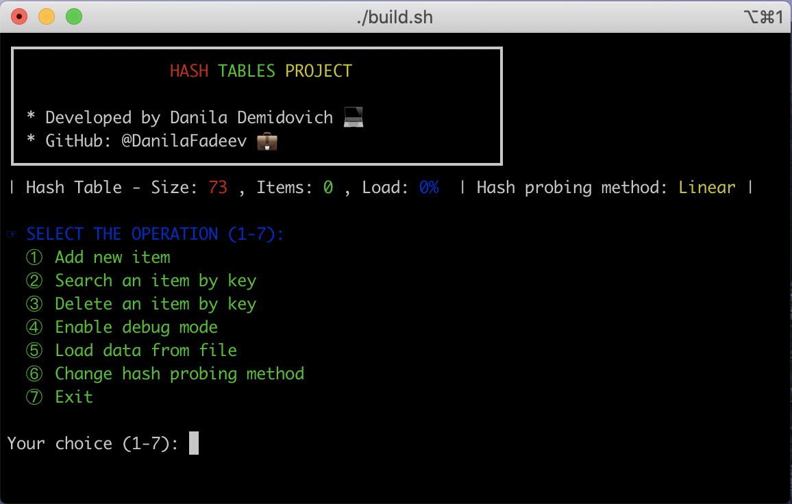

## About this project

This is a custom implementation of hash-tables data structure, using open addressing collision handling in pure C language.

Project is based on the tutorial [Write a hash table in C](https://github.com/jamesroutley/write-a-hash-table).

## Build and run
To launch this program on your machine you have to run `build` bash script which will compile all the source files and run built program.

```$ ./build```

Main screen looks like on a screenshort below.



## Hash tables

In computing, a hash table (hash map) is a data structure that implements an associative array abstract data type, a structure that can map keys to values. A hash table uses a hash function to compute an index, also called a hash code, into an array of buckets or slots, from which the desired value can be found.

Ideally, the hash function will assign each key to a unique bucket, but most hash table designs employ an imperfect hash function, which might cause hash collisions where the hash function generates the same index for more than one key. Such collisions are always accommodated in some way.

In a well-dimensioned hash table, the average cost (number of instructions) for each lookup is independent of the number of elements stored in the table. Many hash table designs also allow arbitrary insertions and deletions of key-value pairs, at (amortized) constant average cost per operation.

In many situations, hash tables turn out to be on average more efficient than search trees or any other table lookup structure. For this reason, they are widely used in many kinds of computer software, particularly for associative arrays, database indexing, caches, and sets.


